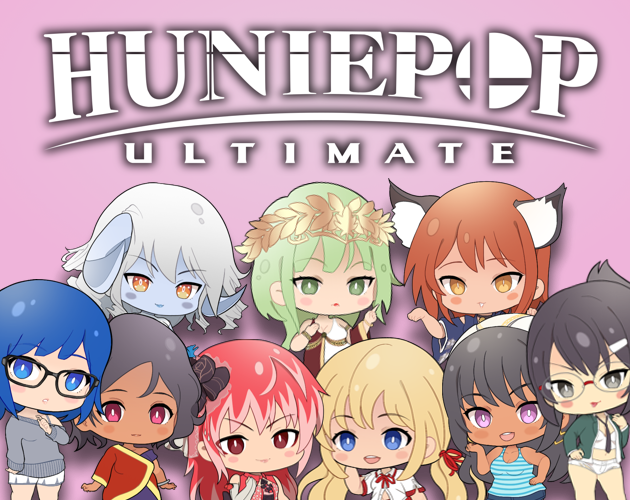
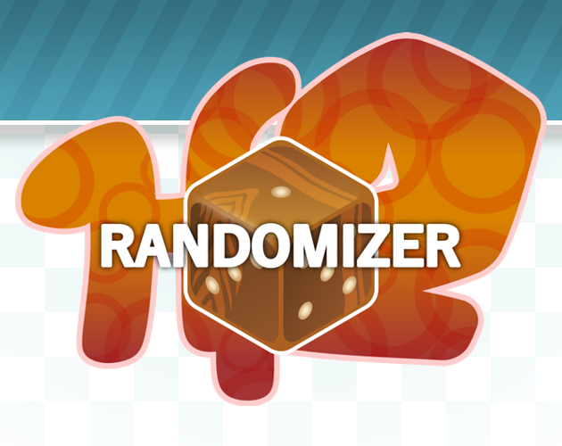
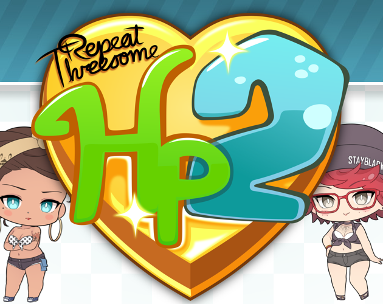
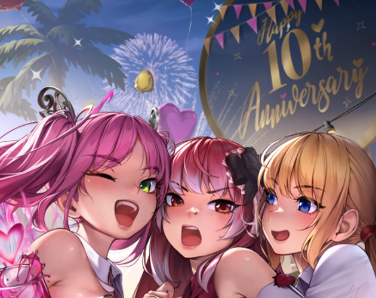
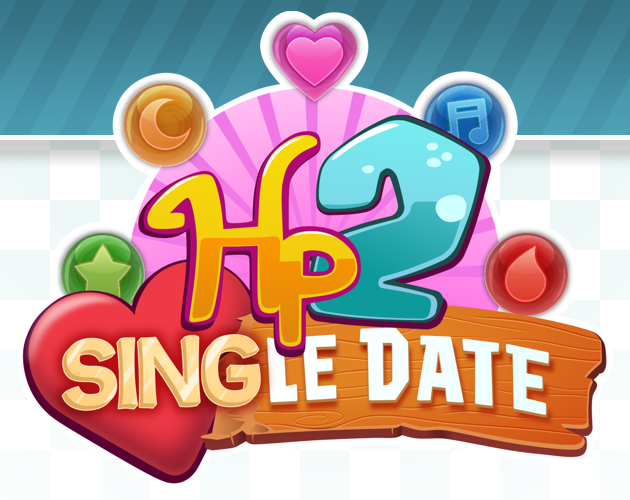
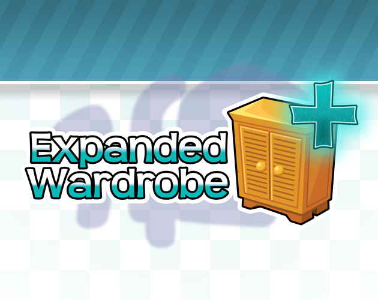
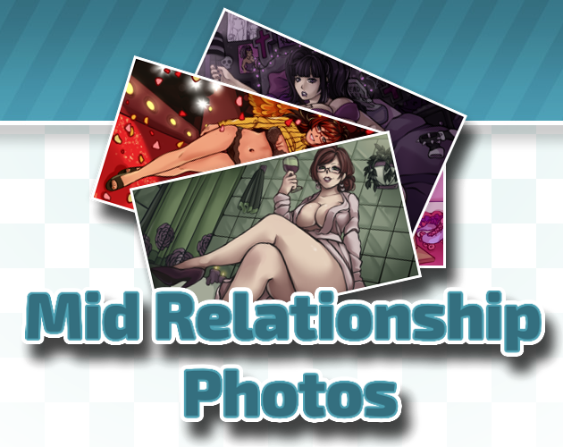

<!--
  GENERATED FILE -- DO NOT EDIT DIRECTLY.
  Generated by mdToItchHtml.py from Hp2BaseMod/page.md
  Generated at: 2026-09-14 03:59:57 UTC
  Edit the source file instead and re-run the generator.
-->

# Hp2BaseMod

A modding framework for [HuniePop 2 - Double Date](https://huniepop2doubledate.com).

---

On its own this mod doesn't affect gameplay, but it does provide handling and utility for other mods!

It is highly recommended you also install **Hp2BaseModTweaks**, which provides modded UI support and extra options. You should always use **Hp2BaseModTweaks** unless it conflicts with another mod.

## Installation

The Hp2BaseMod is built on [BepInEx](https://docs.bepinex.dev/articles/user_guide/installation/index.html). You must install BepInEx to run it or any dependent mods. See [the tutorial](https://onesuchkeeper.itch.io/hp2basemod/devlog/1321045/hp2basemod-installation-guide) for more information.

Once [BepInEx](https://docs.bepinex.dev/articles/user_guide/installation/index.html) is installed, unzip and place the `Hp2BaseMod` folder in:

`HuniePop 2 - Double Date\BepInEx\plugins`

(The folder must be `Hp2BaseMod`! If it's something like `Hp2BaseMod_v1.x.x`, take the `Hp2BaseMod` folder out of that one!)

Other mods based on the Hp2BaseMod must also be placed in:

`HuniePop 2 - Double Date\BepInEx\plugins`

## Dependent Mods

## Support

All money earned from donations will go towards paying artists and voice actors to make assets for projects like this.

You can donate here on itch, or [donate via Patreon](https://www.patreon.com/onesuchkeeper) to see in-development art/builds and vote on stuff.

All of my fan projects will eventually be published for free. You do not need to donate.
